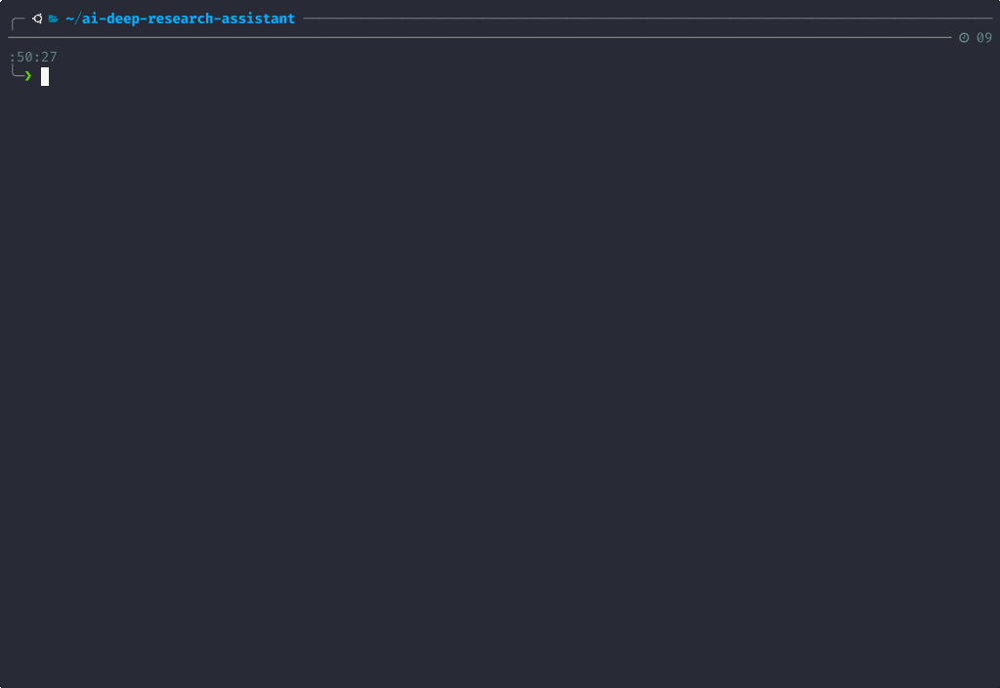

# 🔍 AI Deep Research Assistant

This project demonstrates how to build an AI-powered research assistant by integrating **Pydantic AI** for structured, type-safe agents with **LangGraph** for orchestrating complex multi-agent workflows.

The system implements a Perplexity-like research assistant that answers questions using web-searched evidence, complete with multi-source citations, confidence scoring, and academic analysis. Research depth is dynamically determined by a Planner Agent based on question complexity — simple queries get quick answers, while complex topics trigger deep academic research with multiple cited sources across specialised research agents.

⚠️ Note: This is a proof-of-concept demonstrating architectural integration of the two frameworks. Minimal evaluation or prompt engineering has been performed — the agents are not production-ready.



## ✨ Features

### Core Capabilities
- **Multi-Agent Research**: Parallel execution of specialised research agents (General, Academic, News)
- **Intelligent Query Routing**: Automatic classification of research vs conversational queries
- **Real-time Progress Tracking**: Streaming updates with Rich CLI interface
- **Citation Management**: Professional citation formatting (APA, MLA, Chicago, IEEE)
- **Confidence Scoring**: Transparent reliability assessment for all findings
- **Source Verification**: Credibility assessment and bias detection

### Multi-Agent Architecture
- **Guardrail Agent**: Routes queries to appropriate handlers (research vs conversation)
- **Planning Agent**: Creates comprehensive research plans with task distribution
- **Research Agents**: Specialised agents for general, academic, and news research
- **Synthesis Agent**: Integrates findings from multiple agents into coherent conclusions
- **Conversation Agent**: Handles direct Q&A without research

### Research Quality
- **Academic Standards**: Prioritises peer-reviewed and authoritative sources
- **Evidence-Based**: Every claim backed by specific citations
- **Confidence Metrics**: Transparent scoring of finding reliability
- **Follow-up Suggestions**: Intelligent recommendations for deeper exploration

## 🏗️ Architecture

### System Flow
```
                    ┌─────────────┐
                    │  Guardrail  │
                    │   Agent     │
                    └──────┬──────┘
                           │
                    ┌──────┴──────┐
                    │ Conditional │
                    │   Routing   │
                    └──────┬──────┘
                           │
            ┌──────────────┴──────────────┐
            │                             │
      [Research Path]              [Conversation Path]
            │                             │
            ▼                             ▼
    ┌──────────────┐            ┌─────────────┐
    │   Planning   │            │ Conversation│
    │    Agent     │            │    Agent    │
    └──────┬───────┘            └─────────────┘
            │                             
            │                             
 ┌──────────┼──────────┐
 ▼          ▼          ▼
┌─────┐  ┌─────┐  ┌─────┐
│Gen. │  │Acad.│  │News │
│Res. │  │Res. │  │Res. │
└──┬──┘  └──┬──┘  └──┬──┘
   │        │        │
   └────────┼────────┘
            ▼
    ┌─────────────┐
    │  Synthesis  │
    │    Agent    │
    └─────────────┘
```

### Technology Stack
- **LangGraph**: Stateful workflow orchestration with parallel execution
- **Pydantic AI**: Type-safe agent framework with structured outputs
- **Pydantic Settings**: Configuration management with environment variables
- **Brave Search API**: Web search and content retrieval
- **Rich**: Beautiful terminal interface
- **UV**: Fast Python package management
- **pytest**: Comprehensive testing framework

## 🚀 Quick Start

### Prerequisites
- Python 3.11+
- [UV package manager](https://docs.astral.sh/uv/)
- Brave Search API key
- LLM provider API key (OpenRouter, OpenAI, Anthropic, or Gemini)

### Installation

1. **Clone the repository**
   ```bash
   git clone https://github.com/Alexander-Nestor-Bergmann/ai-deep-research-assistant.git
   cd ai-deep-research-assistant
   ```

2. **Set up environment with UV**
   ```bash
   # Install UV if not already installed
   curl -LsSf https://astral.sh/uv/install.sh | sh
   
   # Create virtual environment and install dependencies
   uv sync
   ```

3. **Configure API keys**
   ```bash
   # Copy environment template
   cp .env.example .env
   
   # Edit .env with your API keys:
   # - BRAVE_API_KEY (required for web search)
   # - OPENROUTER_API_KEY (or another LLM provider key)
   ```

4. **Run your first query**
   ```bash
   # Interactive mode
   uv run python -m ai_deep_research_assistant.main
   
   # Single query mode
   uv run python -m ai_deep_research_assistant.main "What are the latest developments in quantum computing?"
   ```

## 💻 Usage

### Interactive Mode
Start an interactive research session:
```bash
uv run python -m ai_deep_research_assistant.main
```

Features:
- Real-time progress tracking
- Follow-up question suggestions
- Session history
- Beautiful formatted output

### Single Query Mode
Run a one-time research query:
```bash
# Basic research
uv run python -m ai_deep_research_assistant.main "Your research question here"

# With specific options
uv run python -m ai_deep_research_assistant.main "Climate change impacts on agriculture" \
  --citation-style MLA \
  --format markdown \
  --output research_results.md
```

### Command Line Options

| Option | Description | Default |
|--------|-------------|---------|
| `--citation-style` | Citation format (APA, MLA, Chicago, IEEE) | APA |
| `--format` | Output format (json, markdown, plain, rich) | rich |
| `--output` | Save results to file | None |
| `--max-sources` | Maximum sources to analyse | 8 |
| `--timeout` | Max execution time (seconds) | 300 |
| `--debug` | Enable debug logging | false |
| `--quiet` | Suppress progress output | false |

### Example Queries

**Academic Research:**
```bash
uv run python -m ai_deep_research_assistant.main "Compare machine learning approaches for time series forecasting"
```

**Current Events:**
```bash
uv run python -m ai_deep_research_assistant.main "Latest developments in renewable energy technology"
```

**Technical Documentation:**
```bash
uv run python -m ai_deep_research_assistant.main "How does transformer architecture work in LLMs?"
```

## 📁 Project Structure

```
ai-deep-research-assistant/
├── ai_deep_research_assistant/
│   ├── agents/           # Pydantic AI research agents
│   │   ├── guardrail.py      # Query classification and routing
│   │   ├── planner.py        # Research planning and task distribution
│   │   ├── researcher.py     # Multi-type research agents
│   │   ├── synthesizer.py    # Multi-source synthesis
│   │   └── conversation.py   # Direct conversational responses
│   ├── graph/            # LangGraph workflow
│   │   ├── state.py          # State schema definitions
│   │   └── workflow.py       # Workflow orchestration
│   ├── cli/              # Command-line interface
│   │   ├── interface.py      # Rich CLI implementation
│   │   └── formatters.py     # Output formatting
│   ├── tools/            # External integrations
│   │   ├── brave_tools.py    # Brave Search API
│   │   ├── cache.py          # Caching system
│   │   └── web_scraper.py    # Content extraction
│   ├── config/           # Configuration
│   │   └── settings.py       # Pydantic Settings
│   ├── clients.py        # LLM client management
│   └── main.py           # Application entry point
├── tests/                # Test suite
│   └── unit/            # Unit tests
├── Dockerfile           # Docker container definition
├── docker-compose.yml   # Docker orchestration
├── pyproject.toml       # Project configuration
├── uv.lock             # Dependency lock file
├── .env.example        # Environment template
└── README.md          # This file
```

## 🔧 Configuration

### Environment Variables

Create a `.env` file based on `.env.example`:

```bash
# Web Search (Required)
BRAVE_API_KEY=your_brave_api_key

# LLM Provider (Choose one)
AI_SERVICE=openrouter  # Options: openrouter, openai, anthropic, gemini
OPENROUTER_API_KEY=your_key  # Or use appropriate key for chosen service

# Model Selection
MODEL_CHOICE_SMALL=openai/gpt-4o-mini      # Fast, cost-effective
MODEL_CHOICE=anthropic/claude-3-5-sonnet-20241022  # High quality

# Model Parameters
MODEL_TEMPERATURE=0.1
MODEL_MAX_TOKENS=4096

# Research Settings
MAX_SEARCH_RESULTS=8
DEFAULT_RESEARCH_DEPTH=comprehensive  # surface, comprehensive, exhaustive
MIN_CONFIDENCE_THRESHOLD=0.7

# Performance
CACHE_TTL_MINUTES=15
MAX_CONCURRENT_REQUESTS=5
BRAVE_RATE_LIMIT_DELAY=1.0

# Logging
LOG_LEVEL=INFO  # DEBUG, INFO, WARNING, ERROR, CRITICAL
LOG_FORMAT=text # json or text
```

### Supported LLM Providers

| Provider | Models | Configuration |
|----------|--------|---------------|
| **OpenRouter** | All models on platform | `AI_SERVICE=openrouter` |
| **OpenAI** | GPT-4, GPT-3.5 | `AI_SERVICE=openai` |
| **Anthropic** | Claude 3.5, Claude 3 | `AI_SERVICE=anthropic` |
| **Google** | Gemini Pro, Gemini Flash | `AI_SERVICE=gemini` |

## 🐳 Deployment

### Docker Deployment

#### Quick Start with Docker
```bash
# Build and run with Docker Compose
docker-compose up --build

# Or build manually
docker build -t ai-deep-research .

# Run interactively
docker run -it --rm \
  --env-file .env \
  -v $(pwd)/output:/app/output \
  ai-deep-research

# Run with a query
docker run -it --rm \
  --env-file .env \
  -v $(pwd)/output:/app/output \
  ai-deep-research "What are the latest AI developments?"
```

#### Docker Configuration
The Docker image:
- Uses Python 3.11 slim base for minimal size
- Runs as non-root user for security
- Includes health checks
- Mounts output directory for results
- Supports all CLI arguments

#### Production Deployment
For production deployments:
```bash
# Build optimised image
docker build -t ai-deep-research:prod .

# Run with resource limits
docker run -d \
  --name research-assistant \
  --restart unless-stopped \
  --memory="1g" \
  --cpus="2" \
  --env-file .env.production \
  -v /var/data/research:/app/output \
  ai-deep-research:prod
```

### Cloud Deployment

#### Deploy to AWS ECS
```bash
# Build and push to ECR
aws ecr get-login-password --region eu-west-2 | docker login --username AWS --password-stdin $ECR_URI
docker build -t ai-deep-research .
docker tag ai-deep-research:latest $ECR_URI/ai-deep-research:latest
docker push $ECR_URI/ai-deep-research:latest
```

#### Deploy to Google Cloud Run
```bash
# Build and deploy
gcloud builds submit --tag gcr.io/$PROJECT_ID/ai-deep-research
gcloud run deploy ai-deep-research \
  --image gcr.io/$PROJECT_ID/ai-deep-research \
  --platform managed \
  --region europe-west2 \
  --allow-unauthenticated
```

#### Deploy to Azure Container Instances
```bash
# Build and push to ACR
az acr build --registry $ACR_NAME --image ai-deep-research .
az container create \
  --resource-group $RG \
  --name research-assistant \
  --image $ACR_NAME.azurecr.io/ai-deep-research:latest \
  --cpu 2 \
  --memory 1
```

## 🧪 Development

### Setup Development Environment
```bash
# Clone repository
git clone <repo-url>
cd ai-deep-research-assistant

# Install with dev dependencies
uv sync --dev

# Run tests
uv run pytest
```

### Code Quality
```bash
# Format code
uv run ruff format .

# Lint code
uv run ruff check .

# Type checking
uv run mypy src/

# Run all quality checks
uv run ruff format . && uv run ruff check . && uv run mypy src/
```

### Testing
```bash
# Run all tests
uv run pytest

# Run with coverage
uv run pytest --cov=src --cov-report=html

# Run specific test file
uv run pytest tests/unit/test_agents_researcher.py -v

# Run tests matching pattern
uv run pytest -k "test_research" -v
```

## 📊 Performance

### Typical Response Times
- **Simple queries**: 3-5 seconds
- **Research queries**: 10-30 seconds
- **Complex multi-agent research**: 30-45 seconds

### Resource Usage
- **Memory**: ~200-500MB typical
- **CPU**: Moderate (async I/O optimised)
- **Network**: 5-20 API calls per research query

### Optimisation Tips
1. Enable caching for repeated queries
2. Adjust `MAX_SEARCH_RESULTS` based on needs
3. Use `MODEL_CHOICE_SMALL` for the guardrail agent
4. Set appropriate timeouts for your use case

## 🤝 Contributing

This was a simple project, exploring how Pydantic AI agents can link with LangGraph. No further development is planned, but feel free to update it with contributions! Please follow these guidelines:

1. Fork the repository
2. Create a feature branch (`git checkout -b feature/amazing-feature`)
3. Make your changes
4. Add tests for new functionality
5. Ensure all tests pass (`uv run pytest`)
6. Format code (`uv run ruff format .`)
7. Commit your changes (`git commit -m 'Add amazing feature'`)
8. Push to the branch (`git push origin feature/amazing-feature`)
9. Open a Pull Request

### Development Standards
- Use type hints throughout
- Write comprehensive tests
- Follow existing code patterns
- Update documentation as needed
- Use meaningful commit messages

## 🔒 Security

- **API Keys**: Never commit API keys to version control
- **Input Validation**: All inputs validated with Pydantic
- **Rate Limiting**: Built-in API rate limiting
- **Error Handling**: Graceful error recovery
- **Secure Dependencies**: Regular security updates

## 📄 Licence

This project is licensed under the MIT Licence - see the [LICENSE](LICENSE) file for details.

## 🙏 Acknowledgements

- **LangGraph**: For workflow orchestration
- **Pydantic AI**: For the agent framework
- **Brave Search**: For web search API
- **Rich**: For terminal formatting
- **UV**: For fast package management

## 📈 Improvements

### Some great next-step features:
- [ ] Web interface
- [ ] PDF/document analysis
- [ ] Custom knowledge base integration
- [ ] Export to various formats (LaTeX, BibTeX)
- [ ] Multi-language support
- [ ] Voice input/output
- [ ] Collaborative research sessions
- [ ] Research templates

## 📞 Support

- **Issues**: [GitHub Issues](https://github.com/Alexander-Nestor-Bergmann/ai-deep-research-assistant/issues)
- **Discussions**: [GitHub Discussions](https://github.com/Alexander-Nestor-Bergmann/ai-deep-research-assistant/discussions)

---

[⭐ Star on GitHub](https://github.com/Alexander-Nestor-Bergmann/ai-deep-research-assistant) | [🐛 Report Bug](https://github.com/Alexander-Nestor-Bergmann/ai-deep-research-assistant/issues) | [💡 Request Feature](https://github.com/Alexander-Nestor-Bergmann/ai-deep-research-assistant/discussions)